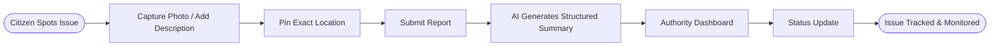
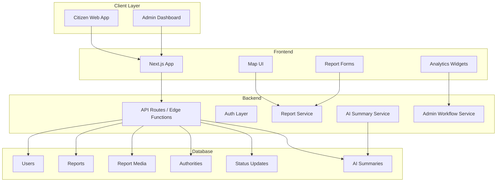
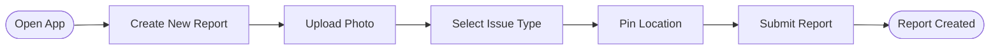
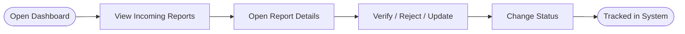
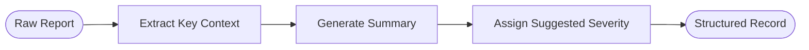
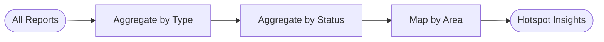

<<<<<<< HEAD
# RoadWatch Core

**RoadWatch Core** is a modular, AI-powered geospatial platform designed for the National Road Safety Hackathon 2026 (IIT Madras). It bridges the gap between citizens and authorities by providing a streamlined reporting system and a data-driven governance dashboard.

## 🚀 Quick Start

1. **Clone & Install**
   ```bash
   npm install
   ```

2. **Environment Setup**
   Copy `.env.local.example` to `.env.local` and add your Supabase credentials:
   ```env
   NEXT_PUBLIC_SUPABASE_URL=your-project-url
   NEXT_PUBLIC_SUPABASE_ANON_KEY=your-anon-key
   ```

3. **Database Setup**
   Run the SQL migration found in `supabase/migrations/20260408000000_initial_schema.sql` in your Supabase SQL Editor.

4. **Run Development Server**
   ```bash
   npm run dev
   ```

## 🛠 Tech Stack

- **Next.js 15**: High-performance React framework.
- **Supabase**: Backend-as-a-Service (PostgreSQL + PostGIS).
- **Leaflet**: Geospatial visualization.
- **Tailwind CSS**: Premium design system.
- **Lucide React**: Modern iconography.

## 📂 Project Structure

- `src/app`: App Router pages (Reporting, Dashboard).
- `src/components`: Modular UI components (Reporting forms, Dashboard maps).
- `src/lib`: Core services (Supabase client, Utils).
- `supabase/migrations`: Database schema versioning.
- `docs`: Architecture, Assumptions, and Presentation outlines.

## 🛡 License
MIT
=======
# ROAD-SAFTY-BY-IITM

# ROADWATCH 360

<div align="center">

# 🛣️ ROADWATCH 360
### AI-Powered Road Quality Monitoring & Public Transparency Platform
**Detect. Report. Verify. Improve.**

[](#)
[](#)
[](#)
[](#)
[](#)
[](https://opensource.org/licenses/MIT)

</div>

---

## 📌 Overview

**RoadWatch 360** is an AI-powered civic road monitoring platform that enables citizens to report road-quality issues, helps authorities visualize them on a map, and improves transparency in road infrastructure management.

The platform is built around three core goals:

- **Monitor road quality** through structured issue reporting.
- **Assist authorities** with a dashboard for filtering, tracking, and prioritizing road problems.
- **Increase public transparency** by organizing road issue data in a clear, location-based system.

This project is designed as a hackathon-ready product for the **RoadWatch** problem statement under the **National Road Safety Hackathon 2026**.

---

## 🚀 Problem Statement Alignment

The official **RoadWatch** problem statement focuses on enabling citizens to monitor road quality, track public spending, and report issues to the responsible authorities in order to improve transparency in road infrastructure.[web:1]

RoadWatch 360 directly addresses this by offering:

- A **citizen reporting layer** for potholes, cracks, waterlogging, and damaged road assets.
- A **geo-enabled dashboard** for viewing and managing reports.
- A **structured issue workflow** for authority-side review and action.
- An extensible architecture that can later support public spending overlays and advanced analytics.

---

## ❗ Problem

Road infrastructure issues often remain unresolved because the reporting process is fragmented, manual, and difficult to track.

| Problem | Current Reality | Impact |
| :--- | :--- | :--- |
| Unstructured complaints | Road issues are often reported through random calls, chats, or social media posts. | Reports get lost and are difficult to verify. |
| No centralized visibility | Citizens and authorities lack one common view of road defects by location. | Prioritization becomes weak and reactive. |
| Limited transparency | People rarely know whether complaints were acknowledged, forwarded, or resolved. | Public trust stays low. |
| Poor evidence capture | Many complaints lack exact location, images, severity, or issue type. | Resolution time increases. |
| Weak analytics | Authorities may receive reports but cannot easily identify hotspots or recurring problem areas. | Maintenance planning becomes inefficient. |

---

## ✅ Solution

RoadWatch 360 creates one unified workflow for road issue reporting and monitoring.

### Core flow

1. A citizen reports an issue with image, location, and description.
2. The platform stores the issue as a structured geo-tagged report.
3. AI helps summarize the complaint and standardize the report.
4. Authorities view issues in a dashboard and on a live map.
5. Reports are updated through stages like **Open → Verified → Forwarded → Resolved**.
6. Over time, the system builds a reusable road-quality intelligence layer.



---

## 🌍 Why This Matters

Road quality directly affects safety, travel comfort, maintenance planning, and public trust.

A modern road-safety system should not only respond to accidents, but also help identify and reduce infrastructure risks before they escalate. RoadWatch 360 aims to act as that preventive layer by making road defects visible, structured, and actionable.

---

## ✨ Key Features

### 📍 Citizen Reporting
- Submit road issues with title, description, and media.
- Pin exact location using interactive maps.
- Select issue category such as pothole, crack, waterlogging, damaged shoulder, or missing marking.
- Track current complaint status.

### 🧠 AI Assistance
- Generate a structured complaint summary from raw user input.
- Suggest severity level based on issue description and type.
- Normalize reports for cleaner dashboard usage.
- Support future expansion into smart categorization and duplicate detection.

### 🗺️ Map-Based Dashboard
- View all reports on a city/locality map.
- Filter by status, severity, issue type, and date.
- Identify clusters and hotspots of recurring road issues.
- Improve visibility for both citizens and administrators.

### 🛠️ Admin / Authority Workflow
- Review incoming issues.
- Mark reports as verified, forwarded, in-progress, or resolved.
- Add status notes and update progress.
- Build a more accountable issue-resolution flow.

### 📊 Analytics Layer
- Total reports by type.
- Open vs resolved issue counts.
- Severity distribution.
- Locality-wise or route-wise issue concentration.

### 🔄 Pivot-Ready Architecture
The project is intentionally built with a shared geospatial core so it can later evolve into:
- **DriveLegal** by adding traffic-law and fine-rule intelligence.
- **RoadSoS** by adding nearby trauma centres, police stations, and emergency routing.

---

## 🧱 System Architecture



---

## 👥 User Roles

| Role | Capabilities |
| :--- | :--- |
| **Citizen** | Create reports, upload images, pin locations, track issue progress |
| **Admin / Reviewer** | Review reports, update statuses, verify issues, manage records |
| **Authority / Operator** | View dashboard, identify hotspots, act on verified reports |
| **AI Layer** | Standardize descriptions, generate summaries, support severity suggestions |

---

## 🌊 Main User Flows

### 1. Citizen Reporting Flow


### 2. Admin Review Flow


### 3. AI Structuring Flow


### 4. Analytics Flow


---

## 🧩 Core Modules

### 1. Report Management
Handles creation, editing, storage, retrieval, and filtering of issue reports.

### 2. Geo Layer
Manages coordinates, map markers, geospatial grouping, and future route/area analytics.

### 3. Media Layer
Stores uploaded issue photos and associates them with report records.

### 4. AI Layer
Converts raw complaint text into cleaner structured summaries and future intelligence features.

### 5. Admin Workflow
Supports report validation, status transitions, and action notes.

### 6. Analytics Layer
Builds dashboards for issue counts, severity trends, and locality-level monitoring.

---

## 🛠️ Tech Stack

| Layer | Technology |
| :--- | :--- |
| **Frontend** | Next.js, React, TypeScript, Tailwind CSS |
| **Backend** | Next.js API Routes / Supabase Edge Functions |
| **Database** | Supabase PostgreSQL |
| **Auth** | Supabase Auth |
| **Storage** | Supabase Storage |
| **Maps** | Leaflet + OpenStreetMap |
| **AI** | Gemini / OpenAI compatible LLM API |
| **Deployment** | Vercel |
| **Optional Geo Extension** | PostGIS |

---

## 📂 Suggested Project Structure

```bash
ROADWATCH_360/
│
├── public/
├── src/
│   ├── app/
│   │   ├── page.tsx
│   │   ├── dashboard/
│   │   ├── reports/
│   │   ├── admin/
│   │   └── api/
│   │
│   ├── components/
│   │   ├── maps/
│   │   ├── reports/
│   │   ├── dashboard/
│   │   ├── ai/
│   │   └── shared/
│   │
│   ├── lib/
│   │   ├── db/
│   │   ├── auth/
│   │   ├── ai/
│   │   ├── geo/
│   │   └── utils/
│   │
│   ├── types/
│   └── styles/
│
├── supabase/
│   ├── migrations/
│   └── seed.sql
│
├── docs/
│   ├── architecture.md
│   ├── roadmap.md
│   └── assumptions.md
│
├── .env.example
├── package.json
└── README.md
```

---

## 🗃️ Database Design Overview

### Main Tables

| Table | Purpose |
| :--- | :--- |
| `users` | Stores user account and profile information |
| `reports` | Core issue records with title, description, category, severity, status, location |
| `report_media` | Stores uploaded images/videos linked to reports |
| `authorities` | Stores mapped local responsible bodies |
| `status_updates` | Tracks lifecycle changes and notes |
| `ai_summaries` | Stores AI-generated structured summaries |

### Example `reports` fields

```sql
id
user_id
title
description
issue_type
severity
status
latitude
longitude
address
created_at
updated_at
```

---

## 🔌 Environment Variables

Create a `.env.local` file:

```env
NEXT_PUBLIC_SUPABASE_URL=your_supabase_url
NEXT_PUBLIC_SUPABASE_ANON_KEY=your_supabase_anon_key
SUPABASE_SERVICE_ROLE_KEY=your_service_role_key
NEXT_PUBLIC_APP_URL=http://localhost:3000
AI_API_KEY=your_llm_api_key
```

---

## ⚙️ Local Development Setup

### 1. Clone the repository
```bash
git clone https://github.com/your-username/ROADWATCH_360.git
cd ROADWATCH_360
```

### 2. Install dependencies
```bash
npm install
```

### 3. Configure environment variables
Create a `.env.local` file and add the required keys.

### 4. Run the development server
```bash
npm run dev
```

### 5. Open in browser
```bash
http://localhost:3000
```

---

## 🧪 MVP Scope

The first stable MVP focuses on the minimum features needed for a functional Stage 1 demo.

### MVP Includes
- User login/auth
- New issue report form
- Image upload
- Map-based location pinning
- Dashboard with issue listing
- Report detail page
- Admin status update flow
- AI-generated complaint summary

### MVP Excludes for now
- Full computer vision defect detection
- Real-time government system integrations
- Live public spending ingestion
- Native mobile application
- Advanced route-level predictive maintenance

---

## 📅 Development Roadmap

### Phase 1 — Foundation
- Project setup
- Auth
- Database schema
- Map integration
- Report creation flow

### Phase 2 — Functional MVP
- Dashboard
- Report filters
- Admin review
- Status tracking
- Media storage

### Phase 3 — AI Layer
- Complaint summarization
- Severity suggestion
- Standardized output
- Smart report formatting

### Phase 4 — Analytics & Polish
- Hotspot view
- Severity analytics
- Better admin UX
- Demo data seeding
- Presentation polish

### Phase 5 — Optional Expansion
- Public spending overlay
- Duplicate issue detection
- DriveLegal pivot module
- RoadSoS pivot module

---

## 🧭 Future Expansion

Because the system is built on a reusable road-safety core, it can later evolve into:

### DriveLegal Extension
- Traffic rule lookup by location
- Violation categories
- Fine schedules
- Legal explanation assistant

### RoadSoS Extension
- Nearby hospitals and trauma centres
- Police station and rescue directory
- Emergency contact workflows
- Accident response support

---

## 🎯 Hackathon Submission Readiness

The Stage 1 requirements include submission through Unstop, along with code, a 7-slide presentation including “Welcome” and “Thank you,” and a Word document covering code details, packages used, and assumptions.[web:1][web:2]

This repository is therefore being structured to support:
- Clean code review
- Easy local setup
- Clear feature demonstration
- Separate documentation for assumptions and architecture
- A demo-ready MVP for judging

---

## 🖼️ Suggested Demo Sections

When presenting this project, show the following sequence:

1. Landing page / project intro
2. Create a road issue report
3. Upload image and pin location
4. AI-generated summary
5. Dashboard issue list
6. Map hotspot visibility
7. Admin status update flow

---

## 📄 Example Demo Accounts

```txt
Citizen Demo
Email: demo@roadwatch.ai
Password: demo123

Admin Demo
Email: admin@roadwatch.ai
Password: admin123
```

> Replace these with actual seeded credentials before final deployment.

---

## 🔐 Security & Data Notes

- Authentication should be enforced for report creation and dashboard access.
- Uploaded media should be validated and size-limited.
- Personally identifiable information should be minimized.
- Admin-only routes must be role-protected.
- API keys must never be exposed client-side unless explicitly safe.

---

## 📈 Why This Project Stands Out

RoadWatch 360 is not just a complaint form. It is a structured **road intelligence platform**.

Its strengths are:
- practical MVP feasibility,
- strong AI narrative,
- visible social impact,
- authority-side utility,
- and the ability to grow into a broader road-safety product beyond the hackathon.

---

## 🤝 Contributors

Add team member details here.

```txt
Name – Role – GitHub – LinkedIn
```

Example:
- Ayush Kumar Jha – Full Stack / AI / Product
- Teammate Name – Backend / Maps / Data
- Teammate Name – UI / Presentation / Research

---

## 📜 License

This project is licensed under the **MIT License**.

---

## 🙌 Acknowledgements

- Centre of Excellence for Road Safety (CoERS), IIT Madras
- National Road Safety Hackathon 2026
- OpenStreetMap community
- Supabase
- Vercel
- Open-source AI and mapping ecosystem

---

## ⭐ Final Note

RoadWatch 360 is being built as a practical, scalable, and modular road-safety product that starts with road issue reporting but is capable of evolving into a wider AI-driven civic infrastructure intelligence platform.
>>>>>>> 067ccbf1f161e3b9e5e13ae8e121c42fe7a4a52b
